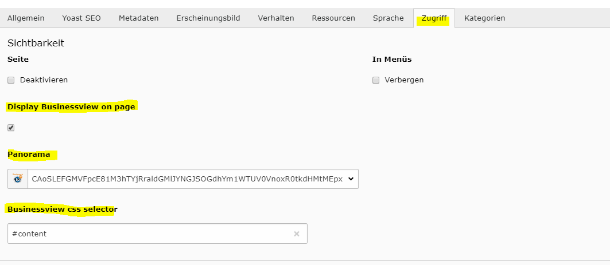
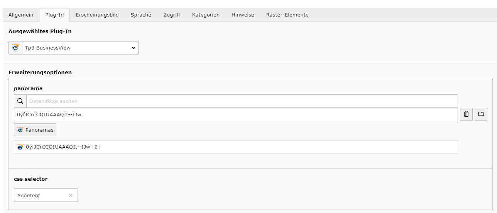

.. ==================================================
.. FOR YOUR INFORMATION
.. --------------------------------------------------
.. -*- coding: utf-8 -*- with BOM.

.. include:: ../Includes.txt

.. _configuration:

Configuration Reference
=======================

https://developers.google.com/maps/documentation/javascript/streetview?hl=de

=======================
Extension Configuration
=======================

Use the Constants Editor to adjust the tp3_businessview to your needs.
A Api Key has to be regitered
https://console.developers.google.com/apis/

The essential domains have to be set in the app for crossdomain referencing.

go to the backend web module and select the Storagepid. You can search in the map box with the small input field for your address or company.
If found click on it and it should display yout panoramas. You can simply navigate in them and save the different views and positions to several panoramas.

.. figure:: ../Images/Pano.png
    :width: 1020px
   :alt: Pano Designer tp3_businessview

After you shoud use the list module to add a Businessview and Addresses. If you want to display social buttons just add the names to the selected tt_address (BusinessAdress)
and they will be displayed upon the Businessview. Same with the address and ...

After this is you can choose the way to view your Businessviews.
    - Page Injection
    - Plugin

Go to edit yout page. on the palette visibility

or use the plugin and select the output spot

.. _configuration-faq:

FAQ
---

Possible subsection: FAQ

next steps are:
    - Social Gallery, Photoalben von Facebook und google.
    - Intro with teaser
    - Opening Hours
    - Reverse loading - loading page & overlays from steetview navigation
    - oculus rift app for real VR
